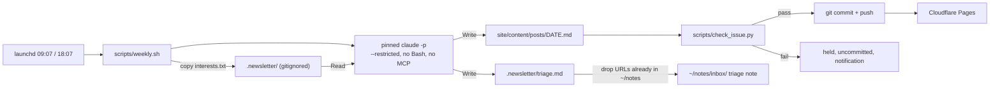

# Weekly local publishing with a quality gate and notes triage

## Goal

`/newsletter-ai` moves off GitHub Actions and runs every week from a launchd agent on the Mac. The agent calls a wrapper script that runs `claude -p` on the subscription, with no shell and no `~/notes` access for the model. The script owns git, a deterministic checker has to pass before anything is pushed, and each issue leaves a short triage note in `~/notes/inbox/`. The [research note](~/notes/research/2026-09-13-newsletter-skills-review-automation.md) explains why.

It's done when an issue lands on `main` from a `launchctl kickstart` with no human in the loop, passes `scripts/check_issue.py`, and leaves `~/notes/inbox/<date>-newsletter-triage.md` behind, and when a second run in the same issue week exits without spending anything.

## Decision

This follows the research's Recommendation for (b) and (d): launchd plus a wrapper, Bash denied, git in the script, and one triage note per issue. It also takes growth rank 1: the quality fixes, an MIT licence, topics and a new description. The user settled four things on 2026-09-13:

- **Scope.** Running it, quality and the notes feed. Growth ranks 2–5 are non-goals.
- **The model sees no `~/notes`.** This departs from the research, which grants `Read(~/notes/**)` and `Edit(~/notes/inbox/**)`. WebFetch can carry data out in a URL, so a prompt-injected page could leak client notes; that's the trifecta the research raises for Bash ([research] [22]) *(inferred)*. The model writes its triage file inside the repo, and `weekly.sh` moves it into `~/notes` itself.
- **Nothing flows from `~/notes` into the newsletter.** The user ruled this out on 2026-09-13. The only link between them runs from the newsletter to the notes, as the triage note. This rejects "From the notebook", which the research proposes in both (d) and growth rank 2. There is one deliberate exception, which the user kept: `weekly.sh` itself, not the model, greps `~/notes` for each triage URL and drops the ones already there. That read only removes lines from the triage note, and nothing it finds reaches an issue.
- **Issues aren't copied into `~/notes`.** The published copy stays in `site/content/posts/`, so skills that grep `~/notes` don't pick up generated text.
- **CI goes.** `.github/workflows/newsletter.yml` and `.github/dependabot.yml` are deleted, not turned into a manual fallback. Git history keeps both, in case the research's fallback of a cloud routine or CI with an OAuth token is ever needed ([research] "What would change this").
- **Publish automatically when the checker passes.** A failing issue stays uncommitted and you get a notification.

Rejected: the Desktop scheduled task (the skill's flag blocks it, and the app has to be open) and a cloud routine (it can't write `~/notes`) ([research] [8][10][11]). cron skips jobs while the Mac sleeps [15].

## Background

Read on 2026-09-13 at `08fd663`, a clean tree on `main`.

**The skill.**
- `allowed-tools: WebSearch, WebFetch, Bash, Write` (`.claude/skills/newsletter-ai/SKILL.md:6`). There is no `Read`, although the skill tells the model to read `sources.md` and `template.md` (`.claude/skills/newsletter-ai/SKILL.md:25`, `:59`).
- `model: claude-opus-4-6` (`.claude/skills/newsletter-ai/SKILL.md:7`). `claude-hacks` pins the same model and also grants Bash (`.claude/skills/claude-hacks/SKILL.md:6-7`).
- `disable-model-invocation: true` (`.claude/skills/newsletter-ai/SKILL.md:5`). User-invoked skills still expand under `-p` ([research] [7]).
- Step 1 searches "the last 7 days" (`.claude/skills/newsletter-ai/SKILL.md:23`). Step 2's only filter rule is "Discard PR fluff, duplicate coverage, and content without substance" (`.claude/skills/newsletter-ai/SKILL.md:53`).
- Step 5 writes an Obsidian vault under `~/Documents/AI-Newsletter-Vault/` and runs `mkdir` through Bash (`.claude/skills/newsletter-ai/SKILL.md:80-171`). LaunchAgents can't read `~/Documents` without Full Disk Access ([research] [21]). The vault doesn't exist on this Mac (`ls` returns "No such file").
- Step 6c runs `git add`, `git commit` and `git push` from the model (`.claude/skills/newsletter-ai/SKILL.md:211-218`).
- Each story ends `[Source: [Label](URL)]` (`.claude/skills/newsletter-ai/template.md:29`), and the headline carries "Issue #[N]" (`.claude/skills/newsletter-ai/template.md:9`).
- The skill isn't installed globally: `~/.claude/skills/newsletter-ai` doesn't exist. Runs from the repo should use the project copy in `.claude/skills/` *(assumption; spike 1 checks this under `--restricted`)*. If they do, the sync step in `CLAUDE.md:52-65` doesn't apply to the script.

**Counts that disagree.** The skill has 12 categories (`.claude/skills/newsletter-ai/sources.md:503`, `.claude/skills/newsletter-ai/SKILL.md:29-40`). `README.md:5`, `CLAUDE.md:9` and `docs/how-it-works.md:75` say 11, and `docs/sources.md` stops at 11 (`docs/sources.md:443`). The twelfth category is secondary sources only (`.claude/skills/newsletter-ai/SKILL.md:40`).

**The two issues.** These defects are the checker's test fixtures. Links were extracted with `grep -oE '\]\(https?://[^)]+\)'`.
- Both issues are titled "2026-W20" (`site/content/posts/2026-05-14.md:2`, `site/content/posts/2026-05-15.md:2`).
- Six unique URLs appear in both. Within 2026-05-15, The Register's DELEGATE-52 URL appears twice, labelled "The Register" and then "Microsoft Research" (`site/content/posts/2026-05-15.md:38`, `:302`).
- A dev.to post is labelled "Reddit / r/MLOps" (`site/content/posts/2026-05-14.md:38`).
- A 2025-08-26 Gartner release (`site/content/posts/2026-05-15.md:128`) and a 2026/04/24 Technology Review URL (`:137`) fall outside that issue's window. `date` in the frontmatter is 2026-05-15, so the window starts 2026-05-08.
- A GlobeNewswire release (`site/content/posts/2026-05-15.md:281`).
- Homepage sources (`site/content/posts/2026-05-15.md:116`, `:230`; `site/content/posts/2026-05-14.md:116`, `:239`, `:248`, `:311`).

**CI.** The workflow runs on Fridays at 09:00 UTC (`.github/workflows/newsletter.yml:5`) with CLI 2.0.13 (`.github/workflows/newsletter.yml:39`), `ANTHROPIC_API_KEY` (`:57`) and `--dangerously-skip-permissions` (`:59`). All 17 scheduled runs since 22 May have failed. Logs survive only for runs from 19 June onwards, and every one of those says the credit balance is too low ([research] [2][3]). Dependabot only scans `github-actions` (`.github/dependabot.yml:7`). Its PRs #3 and #4 bump `actions/checkout` and `actions/setup-node` (`gh pr list`). CI is referenced in `README.md:111`, `:115`, `:119`, `:139-140`, `docs/customising.md:164-198`, `:267-332`, `docs/how-it-works.md:211` and `site/README.md:89-93`.

**This Mac.** `claude` is a symlink to `~/.local/share/claude/versions/2.1.270`, a single Mach-O binary, and 2.1.269 sits beside it, so the installer keeps updating it. `jq`, `perl`, `caffeinate`, `python3` (3.14.7), `gh` and `npm` are all on the PATH. There's no `claude-newsletter` Keychain item yet: `security find-generic-password -s claude-newsletter` finds nothing. User settings enable four plugins (among them `aws-core`, which ships an MCP server with AWS API access) and a `PostToolUse` hook. A headless run in this repo loads all of that unless the flags stop it.

**CLI flags** (`claude --help`, 2.1.270, read 2026-09-13). The research doesn't mention these:
- `--tools` sets which built-in tools exist.
- `--strict-mcp-config` loads only the MCP servers named by `--mcp-config`.
- `--restricted` ignores user, project and local settings files, and removes code-running tools and WebFetch unless `--tools` names them. It also confines file tools to the working directories and `--add-dir`.

Borrowed from the research: `claude setup-token` gives a one-year token for `CLAUDE_CODE_OAUTH_TOKEN` [12]. `dontAsk` denies anything unlisted, and `Edit` rules cover every built-in file write [7][13]. `--max-budget-usd` works only with `-p` [14]. There are open issues about hangs and auth failures under launchd, and the `SHELL=/bin/sh` workaround doesn't always help [20]. launchd runs a missed job when the Mac wakes [15].

## Non-goals

- Growth ranks 2–5: narrowing the topic and signing issues, Buttondown email, packaging as a plugin, and promotion ([research] "Growth").
- "From the notebook", or any other content taken from `~/notes` into an issue. This is rejected, not deferred (see Decision).
- Changes to `claude-hacks` beyond keeping its category count in the docs accurate. Its Bash grant (`.claude/skills/claude-hacks/SKILL.md:6`) is a later spec's concern.
- A CI job for the checker. The user chose to have no workflows. `make check` runs locally.
- Keeping the Obsidian vault as an option. The research says to drop it.
- Rewriting the two published issues. They stay as they are, as history.

## Design

**The skill's arguments.**
- `web:<site>`: as now, but Step 6 only writes the post.
- `triage:<dir>`, new: read `<dir>/interests.txt` and write `<dir>/triage.md`. Without it, Step 5 is skipped, so other users see no change.

**What `weekly.sh` does**, following the research script and changed where marked:
1. It exits 0 if `last-ok` already holds this issue week, or if `api.anthropic.com` is unreachable.
2. *New:* it requires `main` and a clean `git status --porcelain`; otherwise it notifies and exits 1. A held issue blocks later slots until you deal with it, and that's intended.
3. `git pull --ff-only`.
4. *New:* it empties `.newsletter/` and copies `scripts/interests.txt` into it. Nothing from `~/notes` is copied.
5. It reads the token from the Keychain and runs the pinned binary (W5) under `caffeinate` with a one-hour alarm, as in the research. The flags differ:
   `--model sonnet --restricted --strict-mcp-config --permission-mode dontAsk --tools "WebSearch,WebFetch,Read,Write,Edit,Glob,Grep" --allowedTools "WebSearch WebFetch Read(./**) Glob Grep Edit(./site/content/posts/**) Edit(./.newsletter/**)" --max-budget-usd 10 --output-format json`, with `DISABLE_AUTOUPDATER=1` and `SHELL=/bin/sh`.
6. It fails on a non-zero exit code or when `is_error` isn't `false`.
7. *New:* it moves triage. Lines in `.newsletter/triage.md` whose URL `grep -rqF` finds anywhere in `~/notes` are dropped. The rest go to `~/notes/inbox/<date>-newsletter-triage.md`, left uncommitted: the inbox takes any filename and no frontmatter (`~/notes/CLAUDE.md`).
8. *New:* it checks the tree. Exactly one new untracked file under `site/content/posts/` is allowed, with no other change, and it has to pass `check_issue.py`. Otherwise it notifies "held" and exits 1.
9. It commits `Newsletter <date>`, pushes, writes `last-ok` and notifies with `total_cost_usd`.

These environment variables override paths, for tests: `NEWSLETTER_REPO`, `NEWSLETTER_LOG`, `NOTES_DIR`, `CLAUDE_BIN` and `NOTIFY_CMD`. Tests stub the network check and the Keychain read by putting fake `curl` and `security` first on `PATH`.

## Work items

### W1: Retire the CI workflow

- **Change:**
  - Delete the workflow and the Dependabot config.
  - Remove the CI rows and paragraphs from the docs listed in Background. Point readers to "Scheduled publishing (launchd)", a heading in `docs/customising.md` that W7 fills.
  - After confirming with the user: close PRs #3 and #4 with a comment, and delete the `ANTHROPIC_API_KEY` repo secret (`gh secret delete ANTHROPIC_API_KEY`).
- **Files:**
  - `.github/workflows/newsletter.yml` (deleted)
  - `.github/dependabot.yml` (deleted)
  - `README.md`
  - `docs/customising.md`
  - `docs/how-it-works.md`
  - `site/README.md`
- **Done when:**
  - `git ls-files .github` prints nothing.
  - `grep -n 'newsletter.yml\|ANTHROPIC_API_KEY\|dependabot' README.md docs/*.md site/README.md CLAUDE.md` prints nothing. The glob leaves out `docs/specs/`, because this spec names those terms.
  - `gh pr list` shows neither #3 nor #4.
  - `gh secret list` doesn't list `ANTHROPIC_API_KEY`.

### W2: The issue checker

- **Change:** `scripts/check_issue.py <post> [--posts-dir DIR]`, standard library only. It prints `path:line: RULE: message` for each finding and exits 1 if there are any. Rules:
  - `repeat`: a URL used twice in the issue, or used in any of the four previous posts (by filename date).
  - `homepage`: a `[Source: …]` URL whose path is empty or `/`.
  - `stale`: a date in the URL (`YYYY/MM/DD` or `YYYY-MM-DD`) earlier than the frontmatter `date` minus 7 days.
  - `wire`: a URL on globenewswire.com, prnewswire.com, businesswire.com, einpresswire.com or accesswire.com.
  - `label`: the label begins with Reddit, Hacker News, HN, arXiv, Microsoft Research, X, Twitter or GitHub, but the domain isn't that site's. "The Hacker News" (thehackernews.com) is a different publication and doesn't match.
  - `week`: the title's `YYYY-Www` matches an earlier post's.

  Tests copy the two published posts in as fixtures.
- **Files:**
  - `scripts/check_issue.py` (new)
  - `tests/test_check_issue.py` (new)
  - `tests/fixtures/` (new)
- **Done when:** `python3 -m unittest discover tests` passes, and asserts that:
  - checking 2026-05-15 against 2026-05-14 reports exactly these:
    - `repeat` for the six shared URLs, and for The Register URL at 38 and 302;
    - `homepage` at 116 and 230;
    - `stale` at 128, 137, 179, 197 and 272;
    - `wire` at 281;
    - `label` at 302;
    - `week`;
  - checking 2026-05-14 on its own reports exactly these:
    - `label` at 38;
    - `repeat` for `ai.pydantic.dev/` at 116 and 248;
    - `homepage` at 116, 239, 248 and 311;
    - `stale` at 146 and 227;
  - a clean fixture written for the test exits 0.

  Each assertion is written, and fails, before the rule that satisfies it.

### W3: Harden the skill

- **Change:**
  - `allowed-tools: WebSearch, WebFetch, Read, Write`. Delete the `model:` line; the research suggests `model: inherit`, and omitting it should leave the session model in charge *(assumption)*.
  - Add hard rules to Step 2, mirroring W2: no URL from the last four posts under `<web>/content/posts/`, no story twice, the item's own date inside the window, article URLs only, a label that names the publisher of the linked page, no press-release wires.
  - Remove Step 5 and its supporting files.
  - Step 6 writes the post and prints its path. Delete 6c.
  - Replace "Issue #[N]" with the ISO week.
  - Update the run rules in `CLAUDE.md`: 12 categories, no vault line, no `test -f`.
- **Files:**
  - `.claude/skills/newsletter-ai/SKILL.md`
  - `.claude/skills/newsletter-ai/template.md`
  - `CLAUDE.md`
  - `.claude/skills/newsletter-ai/obsidian-template.md` (deleted)
  - `.claude/skills/newsletter-ai/newsletter-structure.canvas` (deleted)
  - `.claude/skills/newsletter-ai/sources.canvas` (deleted)
- **Done when:**
  - `grep -nE 'Bash|git push|Documents|model:' .claude/skills/newsletter-ai/SKILL.md` prints nothing.
  - `git ls-files .claude/skills/newsletter-ai` lists exactly `SKILL.md`, `sources.md` and `template.md`.

### W4: The wrapper and its offline test

- **Change:**
  - Add `scripts/weekly.sh` as designed.
  - Add `scripts/interests.txt` as a starter list: kubernetes, terraform, aws, gcp, ai, security, cost, claude-code, observability, gpu.
  - Add `.newsletter/` to a root `.gitignore`.
  - Add a fake `claude` that writes a fixture post and triage file and prints `{"is_error":false,"total_cost_usd":0}`.
  - Add a bash test that clones the repo into a temp dir with a bare remote and runs the wrapper against the fake.
  - Add `make check`: the unit tests, the bash test, `bash -n` on every script, and `shellcheck` when it's installed.
- **Files:**
  - `scripts/weekly.sh` (new)
  - `scripts/interests.txt` (new)
  - `.gitignore` (new)
  - `tests/fake-claude.sh` (new)
  - `tests/weekly_test.sh` (new)
  - `Makefile` (new)
- **Done when:** `make check` passes, and `tests/weekly_test.sh` asserts:
  - with a clean fixture, the bare remote gains one commit that touches only `site/content/posts/`, and `last-ok` holds the week;
  - a second run makes no commit and doesn't call the fake (it counts calls);
  - with a failing fixture, nothing is pushed, the post stays untracked and `NOTIFY_CMD` receives "held";
  - if the fake also edits `README.md`, nothing is pushed;
  - a triage URL planted in a fake `NOTES_DIR` is dropped from the inbox file, and a new URL is kept;
  - with the network check stubbed to fail, the script exits 0 without calling the fake.

### W5: launchd agent, pinned CLI, first live run

- **Change:**
  - `scripts/install-agent.sh` checks that `claude-newsletter` exists in the Keychain without printing it. If it's missing, it prints the manual steps: run `claude setup-token`, then `security add-generic-password -s claude-newsletter -a "$USER" -w`, with `-w` last so that it prompts.
  - It copies a vetted binary, `~/.local/share/claude/versions/$CLAUDE_PIN`, to `~/.local/share/newsletter-ai/claude`.
  - It renders `scripts/local.newsletter-ai.weekly.plist.in` with `$HOME` into `~/Library/LaunchAgents/`, runs `plutil -lint`, then `launchctl bootout` (if loaded) and `bootstrap gui/$(id -u)`.
  - The plist is the research's, with paths templated and `CLAUDE_PIN` recorded in the script. Run the spikes first.
- **Files:**
  - `scripts/install-agent.sh` (new)
  - `scripts/local.newsletter-ai.weekly.plist.in` (new)
- **Done when:**
  - `launchctl print gui/$(id -u)/local.newsletter-ai.weekly` shows both calendar intervals.
  - `launchctl kickstart -k gui/$(id -u)/local.newsletter-ai.weekly` ends with a new commit on `origin/main`, and the Pages URL serves the post.
  - `jq '.is_error, .total_cost_usd, (.modelUsage|keys)' ~/Library/Logs/newsletter/<week>.json` shows `false`, a number and a Sonnet model.
  - 10 links chosen by hand are correctly labelled and inside the window ([research] "Next step").
  - A second kickstart logs nothing new.

### W6: Notes triage

- **Change:**
  - Add Step 5 to the skill, run only with `triage:`. It writes `<dir>/triage.md` with up to five items that match `interests.txt`. The items can come from the issue, or be ones Step 2 cut for space. Each has its link and a ready-to-run `/idea …` or `/research quick …` line.
  - `weekly.sh` passes `triage:./.newsletter`.
- **Files:**
  - `.claude/skills/newsletter-ai/SKILL.md`
  - `scripts/weekly.sh`
  - `tests/fake-claude.sh`
- **Done when:**
  - The next live run leaves `~/notes/inbox/<date>-newsletter-triage.md` with 0–5 items, none of whose URLs `grep -rF` finds elsewhere in `~/notes`.
  - `make check` passes.

### W7: Docs, licence, topics

- **Change:**
  - Rewrite `CLAUDE.md` "Publishing a new issue", `README.md` "Two ways to publish" and "Repository structure", and `docs/customising.md` "Scheduled publishing (launchd)" for the new flow, with interactive use as `scripts/weekly.sh`.
  - Drop the vault sections (`README.md:77-87`, `docs/how-it-works.md:132-198`, `docs/customising.md:70-104`) and fix the category counts, including "11-category" in the last line of `CLAUDE.md`.
  - The grep below also finds about 20 stray mentions to clear: the workflow diagram, file roles and invocation examples in `docs/how-it-works.md`, and vault lines in `docs/customising.md`, among them its "Adding a category" steps.
  - Replace the sample "Issue #20" (`README.md:23`) with the ISO-week form.
  - Renumber the example category in `docs/customising.md:36` to 13, since a real category 12 now exists.
  - Add category 12 to `docs/sources.md`.
  - Add an MIT `LICENSE` (Chris Adkin, 2026).
  - After confirming with the user, run `gh repo edit` to set a description without "Obsidian Vault" and topics such as `claude-code`, `claude-skills`, `newsletter`, `agentic-ai`, `llm` and `hugo`.
- **Files:**
  - `CLAUDE.md`
  - `README.md`
  - `docs/customising.md`
  - `docs/how-it-works.md`
  - `docs/sources.md`
  - `LICENSE` (new)
- **Done when:**
  - `grep -niE 'obsidian|vault|eleven|11[ -](source )?categor|Issue #' README.md CLAUDE.md docs/*.md` prints nothing.
  - `gh repo view --json licenseInfo,repositoryTopics,description` shows MIT, the topics and the new description.

## Effort

| Item | Estimate | Depends on |
|---|---|---|
| W1 Retire CI | 0.5 h | none |
| W2 Checker | 3 h | none |
| W3 Harden skill | 1.5 h | W2 (rules mirror it) |
| W4 Wrapper and test | 4 h | W2, W3 |
| Spikes | 1 h | none |
| W5 Agent and live run | 2 h, plus a run of up to 1 h | W4, spikes |
| W6 Triage | 1.5 h | W5 |
| W7 Docs, licence, topics | 2 h | W1–W6 |

These estimates come from reading the code, not from doing the work, so trust the ordering more than the numbers. About two days in total.

## Spike questions

1. **Do the flags work together?** Under `-p --restricted --strict-mcp-config --tools … --permission-mode dontAsk --allowedTools …`, does a project skill still expand, can the model read `./` and write `./site/content/posts/`, and is it refused `~/notes/CLAUDE.md` and `./scripts/`? Cheapest test: in a scratch clone, add `.claude/skills/probe/SKILL.md` that attempts those four operations and reports each result, then run `/probe` with `--max-budget-usd 0.5`. If `--restricted` stops skills loading, use `--setting-sources project` instead and repeat.
2. **Does a copied binary stay pinned?** Does `~/.local/share/newsletter-ai/claude`, run with `DISABLE_AUTOUPDATER=1` and `CLAUDE_CODE_OAUTH_TOKEN`, answer `-p "say ok" --output-format json` without updating itself? Under subscription auth, does the result set `total_cost_usd`, and does it contain `modelUsage`, which W5 uses to confirm the model *(assumption)*? Run it, then compare `--version` and the file's hash before and after.
3. **Does it survive launchd?** Does the job hang [20], hit a Keychain prompt, or lose its notifications? Install the agent with `PROBE=1`, which makes `weekly.sh` send the "say ok" prompt, then `kickstart` it.

## Risks and rollback

- **The first run holds its issue.** The rules are stricter than the model has been, so W5's first kickstart may be held. Expect it; tune Step 2 before the rules.
- **Subscription limits or terms change.** A run counts against plan limits, and `-p` use may move to metered credit with notice ([research] [16]). `--max-budget-usd 10` caps a single run.
- **Rollback:** `launchctl bootout gui/$(id -u)/local.newsletter-ai.weekly`, then revert the branch. Outside the repo, these change and have to be undone by hand:
  - on the Mac: the plist, the pinned binary, the Keychain item, `~/Library/Logs/newsletter/` and the inbox notes;
  - on GitHub: the deleted secret, the closed PRs, and the description and topics.

## Open questions

- None.
