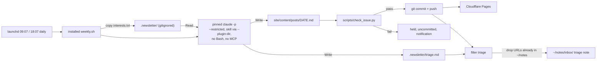

# Weekly local publishing with a quality gate and notes triage

## Goal

`/newsletter-ai` moves off GitHub Actions and runs every week from a launchd agent on the Mac. The agent calls a wrapper script that runs `claude -p` on the subscription, with no shell and no `~/notes` access for the model. The script owns git, a deterministic checker has to pass before anything is pushed, and each published issue leaves a short triage note in `~/notes/inbox/`. The [research note](~/notes/research/2026-09-13-newsletter-skills-review-automation.md) explains why.

It's done when an issue lands on `main` from a `launchctl kickstart` with no human in the loop, passes `scripts/check_issue.py`, and leaves `~/notes/inbox/<date>-newsletter-triage.md` behind, and when a second run in the same issue week exits without spending anything.

## Decision

This follows the research's Recommendation for (b) and (d): launchd plus a wrapper, Bash denied, git in the script, and one triage note per issue. It also takes growth rank 1: the quality fixes, an MIT licence, topics and a new description. The user settled these on 2026-09-13:

- **Scope.** Running it, quality and the notes feed. Growth ranks 2–5 are non-goals.
- **The model sees no `~/notes`.** This departs from the research, which grants `Read(~/notes/**)` and `Edit(~/notes/inbox/**)`. WebFetch can carry data out in a URL, so a prompt-injected page could leak client notes; that's the trifecta the research raises for Bash ([research] [22]) *(inferred)*. The model writes its triage file inside the repo, and after the push `weekly.sh` filters it and moves it into `~/notes` itself.
- **Nothing flows from `~/notes` into the newsletter.** The user ruled this out on 2026-09-13. The only link between them runs from the newsletter to the notes, as the triage note. This rejects "From the notebook", which the research proposes in both (d) and growth rank 2. There is one deliberate exception, which the user kept: `weekly.sh` itself, not the model, greps `~/notes` for each triage URL and drops the ones already there. That read only removes lines from the triage note, and nothing it finds reaches an issue.
- **Issues aren't copied into `~/notes`.** The published copy stays in `site/content/posts/`, so skills that grep `~/notes` don't pick up generated text.
- **CI goes.** `.github/workflows/newsletter.yml` and `.github/dependabot.yml` are deleted, not turned into a manual fallback. Git history keeps both, in case the research's fallback of a cloud routine or CI with an OAuth token is ever needed ([research] "What would change this").
- **Publish automatically when the checker passes.** A failing issue stays uncommitted and you get a notification.

Rejected: the Desktop scheduled task (the skill's flag blocks it, and the app has to be open) and a cloud routine (it can't write `~/notes`) ([research] [8][10][11]). cron skips jobs while the Mac sleeps [15].

## Background

Read on 2026-09-13 at `08fd663`, a clean tree on `main`.

**The skill.**
- `allowed-tools: WebSearch, WebFetch, Bash, Write` (`.claude/skills/newsletter-ai/SKILL.md:6`). There is no `Read`, although the skill tells the model to read `sources.md` and `template.md` (`.claude/skills/newsletter-ai/SKILL.md:25`, `:59`). `allowed-tools` pre-approves tools for the turn that invokes the skill ([research] [8]), and under `-p` that turn is the whole run, as the research infers. Spike 1 confirmed the effect: a bare `Write` there overrides the CLI's path-scoped `Edit` rules (see "Spike results").
- `argument-hint` still offers `vault:` (`.claude/skills/newsletter-ai/SKILL.md:4`).
- `model: claude-opus-4-6` (`.claude/skills/newsletter-ai/SKILL.md:7`). `claude-hacks` pins the same model and also grants Bash (`.claude/skills/claude-hacks/SKILL.md:6-7`).
- `disable-model-invocation: true` (`.claude/skills/newsletter-ai/SKILL.md:5`). User-invoked skills still expand under `-p` ([research] [7]), though not as project skills under `--restricted` (see "Spike results").
- Step 1 searches "the last 7 days" (`.claude/skills/newsletter-ai/SKILL.md:23`). Step 2 asks about relevance, recency, signal and audience fit (`.claude/skills/newsletter-ai/SKILL.md:46-51`); its only discard rule is "Discard PR fluff, duplicate coverage, and content without substance" (`.claude/skills/newsletter-ai/SKILL.md:53`).
- Step 5 writes an Obsidian vault under `~/Documents/AI-Newsletter-Vault/` and runs `mkdir` through Bash (`.claude/skills/newsletter-ai/SKILL.md:80-171`). LaunchAgents can't read `~/Documents` without Full Disk Access ([research] [21]). The vault doesn't exist on this Mac (`ls` returns "No such file").
- Step 5 is also the only place the issue date and ISO week are defined (`.claude/skills/newsletter-ai/SKILL.md:100-101`). Step 6 uses both, in the filename and the title (`.claude/skills/newsletter-ai/SKILL.md:187`, `:193`), and Step 6d appends to Step 5e's confirmation block (`.claude/skills/newsletter-ai/SKILL.md:224`).
- Step 6c runs `git add`, `git commit` and `git push` from the model (`.claude/skills/newsletter-ai/SKILL.md:211-218`).
- Each story ends `[Source: [Label](URL)]` (`.claude/skills/newsletter-ai/template.md:29`), and the headline carries "Issue #[N]" (`.claude/skills/newsletter-ai/template.md:9`). The label placeholders name a kind of source rather than a publisher: `[Platform/Subreddit]` (`.claude/skills/newsletter-ai/template.md:29`), `[arXiv / Conference / Institution]` (`:50`), `[OWASP / MITRE / NIST / Research]` (`:113`).
- The run rules sit in `CLAUDE.md`, not the skill (`CLAUDE.md:9-14`), and two of them are about the vault and its canvas files (`CLAUDE.md:12`, `:14`).
- The skill isn't installed globally: `~/.claude/skills/newsletter-ai` doesn't exist. Headless runs load the repo's copy through `--plugin-dir` (Design step 6), so the sync step in `CLAUDE.md:52-67` doesn't apply to the script.

**Counts that disagree.** The skill has 12 categories (`.claude/skills/newsletter-ai/sources.md:503`, `.claude/skills/newsletter-ai/SKILL.md:29-40`). `README.md:5` says eleven, `CLAUDE.md:9` and `docs/how-it-works.md:75` say 11, and `docs/sources.md` stops at 11 (`docs/sources.md:443`). The twelfth category is secondary sources only (`.claude/skills/newsletter-ai/SKILL.md:40`).

**The two issues.** These defects are the checker's test fixtures. Links were extracted with `grep -oE '\]\(https?://[^)]+\)'`.
- Both issues are titled "2026-W20" (`site/content/posts/2026-05-14.md:2`, `site/content/posts/2026-05-15.md:2`).
- Six unique URLs appear in both. Within 2026-05-15, The Register's DELEGATE-52 URL appears twice, labelled "The Register" and then "Microsoft Research" (`site/content/posts/2026-05-15.md:38`, `:302`).
- A dev.to post is labelled "Reddit / r/MLOps" (`site/content/posts/2026-05-14.md:38`).
- Five links in 2026-05-15 carry a day before that issue's window: a 2025-08-26 Gartner release (`site/content/posts/2026-05-15.md:128`), and Technology Review, CNBC, TechCrunch and CNBC URLs dated 2026-04-24 to 2026-05-07 (`site/content/posts/2026-05-15.md:137`, `:179`, `:197`, `:272`). `date` in the frontmatter is 2026-05-15, so the window starts 2026-05-08.
- Three more are old but carry no day: arXiv IDs from November 2025 and April 2026 (`site/content/posts/2026-05-14.md:77`, `site/content/posts/2026-05-15.md:86`), and a NIST URL under `/2025/12/` (`site/content/posts/2026-05-14.md:320`).
- A GlobeNewswire release (`site/content/posts/2026-05-15.md:281`).
- Homepage sources (`site/content/posts/2026-05-15.md:116`, `:230`; `site/content/posts/2026-05-14.md:116`, `:239`, `:248`, `:311`).
- Three stories repeat under different URLs: Daybreak (`site/content/posts/2026-05-14.md:176`, `site/content/posts/2026-05-15.md:98`), the NVIDIA and IREN deal (`site/content/posts/2026-05-14.md:290`, `site/content/posts/2026-05-15.md:272`) and the EU AI omnibus deal (`site/content/posts/2026-05-14.md:218`, `site/content/posts/2026-05-15.md:209`).

**CI.** The workflow runs on Fridays at 09:00 UTC (`.github/workflows/newsletter.yml:5`) with CLI 2.0.13 (`.github/workflows/newsletter.yml:39`), `ANTHROPIC_API_KEY` (`:57`) and `--dangerously-skip-permissions` (`:59`). All 17 scheduled runs since 22 May have failed. Logs survive only for runs from 19 June onwards, and every one of those says the credit balance is too low ([research] [2][3]). Dependabot only scans `github-actions` (`.github/dependabot.yml:7`). Its PRs #3 and #4 bump `actions/checkout` and `actions/setup-node` (`gh pr list`). CI is referenced in `README.md:111`, `:115`, `:119`, `:138-140`, `docs/customising.md:164-198`, `:267-332`, `docs/how-it-works.md:211` and `site/README.md:89-93`.

**This Mac.** `claude` is a symlink to `~/.local/share/claude/versions/2.1.270`, a single Mach-O binary, and 2.1.269 sits beside it, so the installer keeps updating it. `jq`, `perl`, `caffeinate`, `python3` (3.14.7), `gh` and `npm` are all on the PATH; `shellcheck` isn't. There's no `claude-newsletter` Keychain item yet: `security find-generic-password -s claude-newsletter` finds nothing. User settings enable four plugins (among them `aws-core`, which ships an MCP server with AWS API access) and a `PostToolUse` hook. A headless run in this repo loads all of that unless the flags stop it. Under `--restricted`, spike 1 saw none of it.

**The GitHub repo.** Its description is "AI skill to produce AI newsletter and letter in Obsidian Vault format", and it has no licence and no topics (`gh repo view --json description,repositoryTopics,licenseInfo`, 2026-09-13).

**CLI flags** (`claude --help`, 2.1.270, read 2026-09-13). The research doesn't mention these:
- `--tools` sets which built-in tools exist.
- `--strict-mcp-config` loads only the MCP servers named by `--mcp-config`.
- `--restricted` ignores user, project and local settings files, and removes code-running tools and WebFetch unless `--tools` names them. It also confines file tools to the working directories and `--add-dir`, and lets only a person or a configured permission handler approve writes to settings, git and tool-configuration files. Spike 1 confirmed both under `-p` with `dontAsk`, and found that it also stops project skills from loading.
- `--plugin-dir` loads a plugin from a directory for the session; its skills are named `<plugin>:<skill>`.

**Spike results.** Run on 2026-09-13 with 2.1.270, in a scratch clone, with this session's `CLAUDE*` environment variables unset. They used about $0.37 at API rates, from the subscription.
- **`--restricted` alone.** A project skill doesn't load: `/probe` returned "Unknown command: /probe". Adding `--setting-sources project` doesn't help. The run still exited 0, with `is_error: false`, `num_turns: 0` and no cost.
- **`--setting-sources project` without `--restricted`.** This loads the skill and the project `CLAUDE.md`, but the model could Read `~/notes/CLAUDE.md` and Grep and Glob `~/notes`. That rules it out.
- **`--restricted --plugin-dir ./.claude`.** With `.claude/.claude-plugin/plugin.json` naming the plugin, the repo's skills load as `<name>:<skill>`, and the confinement holds:
  - The skill could read its own supporting files and `./README.md`, write under `./site/content/posts/`, and use WebFetch.
  - Reading `~/notes/CLAUDE.md` and Grep on `~/notes` were refused as outside the working directory; Glob there found nothing.
  - Writes to `./scripts/x`, `.git/hooks/x` and `.claude/settings.local.json` were refused.
  - A plugin directory outside the repo loads too, but `--restricted` then blocks the skill from reading its own supporting files.
- **A skill's grant widens the CLI's scope.** With `Write` added to the probe's `allowed-tools`, the model wrote `./scripts/x`. `.git/hooks/x` and `.claude/settings.local.json` stayed refused.
- **What `--restricted` loads.** The project `CLAUDE.md` doesn't load. The init message lists no MCP servers, no plugins beyond `--plugin-dir`, and exactly the tools `--tools` names.
- **Paths.** Once, with the plugin outside the repo, the model resolved `./README.md` against the skill's directory.
- **Pinning.** A copy of the 2.1.270 binary run with `DISABLE_AUTOUPDATER=1` kept its hash and version, and no new version appeared in `~/.local/share/claude/versions/`. This used the normal subscription login; `CLAUDE_CODE_OAUTH_TOKEN` is untested.
- **Cost fields.** Under subscription auth the result sets `total_cost_usd` and `modelUsage`. A skill run's `modelUsage` lists `claude-haiku-4-5-20251001` as well as `claude-sonnet-5`.
- **Budget cap.** `--max-budget-usd 0.01` stopped a web-search prompt after one turn, with exit 1, `is_error: true`, subtype `error_max_budget_usd`, at $0.013. The cap is enforced, but it's checked between turns, so a run can overshoot by one turn.
- **Model.** The probe skill had no `model:` line and ran on the session's `--model sonnet`, which resolved to `claude-sonnet-5`.

Borrowed from the research: `claude setup-token` gives a one-year token for `CLAUDE_CODE_OAUTH_TOKEN` [12]. `dontAsk` denies anything unlisted, and `Edit` rules cover every built-in file write [7][13]. `--max-budget-usd` works only with `-p` [14]. There are open issues about hangs and auth failures under launchd, and the `SHELL=/bin/sh` workaround doesn't always help [20]. launchd runs a missed job when the Mac wakes [15]. The research's script counts the issue week as the ISO week of the date four days earlier, so Friday to Thursday share one week, and its plist starts the job at 09:07 and 18:07 every day ([research] "Recommendation").

## Non-goals

- Growth ranks 2–5: narrowing the topic and signing issues, Buttondown email, packaging as a plugin, and promotion ([research] "Growth").
- "From the notebook", or any other content taken from `~/notes` into an issue. This is rejected, not deferred (see Decision).
- Changes to `claude-hacks` beyond keeping its category count in the docs accurate. Its Bash grant (`.claude/skills/claude-hacks/SKILL.md:6`) is a later spec's concern.
- A CI job for the checker. The user chose to have no workflows. `make check` runs locally.
- Keeping the Obsidian vault as an option. The research says to drop it.
- Rewriting the two published issues. They stay as they are, as history.
- Catching one story under two URLs, as in the three pairs in Background. The checker compares URLs only; W3's "no story twice" rule is the model's to follow.

## Design

**The skill's arguments.**
- `web:<site>`: as now, but Step 6 only writes the post.
- `date:<YYYY-MM-DD>` and `week:<YYYY-Www>`, new: the post's filename and frontmatter `date`, and the week in its title. Without them the skill uses today, and the ISO week of the date four days earlier, the same rule as `weekly.sh`.
- `triage:<dir>`, new: read `<dir>/interests.txt` and write `<dir>/triage.md`. Without it, Step 5 is skipped.

Other users do see changes: the vault and the automatic push go (W3), and titles carry the week rather than an issue number. W7's README says so.

**What `weekly.sh` does.** It sets `DATE=$(date +%F)` and `WEEK=$(date -v-4d +%G-W%V)`, as the research script does, so an issue week runs Friday to Thursday. launchd starts it at 09:07 and 18:07 every day, which gives each week 14 slots. Success is recorded in `$NEWSLETTER_LOG/last-ok`. The steps follow the research script, changed where marked:
1. It exits 0 if `last-ok` already holds `$WEEK`, or if `api.anthropic.com` is unreachable.
2. *New:* it notifies, without stopping, if `~/.claude/skills/newsletter-ai` exists, or if the repo's `scripts/weekly.sh` differs from the installed copy that's running.
3. *New:* it requires `main` and a clean `git status --porcelain`; otherwise it notifies and exits 1. A held issue blocks later slots until you deal with it, and that's intended.
4. *New:* `git fetch`. If `main` is ahead of `origin/main` by one commit, named `Newsletter <date>` and adding one file under `site/content/posts/`, the last push failed: it pushes that commit and goes to step 10. If `main` is ahead in any other way, it notifies and exits 1. Otherwise it runs `git pull --ff-only`.
5. *New:* it empties `.newsletter/` and copies `scripts/interests.txt` into it. Nothing from `~/notes` is copied.
6. It reads the token from the Keychain and runs the pinned binary (W6) under `caffeinate` with a one-hour alarm, as in the research. The prompt is `/newsletter:newsletter-ai web:$REPO/site date:$DATE week:$WEEK triage:$REPO/.newsletter`; W4 builds it without `triage:`, and W5 adds that.
   - The skill loads as a plugin from the repo's `.claude/`, because `--restricted` doesn't load project skills (see "Spike results").
   - The paths are absolute because the model once resolved `./` against the skill's directory.

   The flags differ:
   `--model sonnet --restricted --plugin-dir "$REPO/.claude" --strict-mcp-config --permission-mode dontAsk --tools "WebSearch,WebFetch,Read,Write,Edit,Glob,Grep" --allowedTools "WebSearch WebFetch Read(./**) Glob Grep Edit(./site/content/posts/**) Edit(./.newsletter/**)" --max-budget-usd 10 --output-format json`, with `DISABLE_AUTOUPDATER=1` and `SHELL=/bin/sh`.
7. It fails, and notifies, on a non-zero exit code, when `is_error` isn't `false`, or when `num_turns` is 0. A skill that doesn't load exits 0 with "Unknown command" and no turns (see "Spike results"), and without this check it would reach step 8 as a misleading "held".
8. *New:* it checks the tree. The only change allowed is one new untracked file, `site/content/posts/$DATE.md`, and it has to pass `check_issue.py --week "$WEEK"`. Otherwise it notifies "held" and exits 1, leaving the post and `.newsletter/triage.md` where they are.
9. It commits `Newsletter $DATE` and pushes. If the push fails it notifies and exits 1, and step 4 retries the push on the next slot.
10. It writes `last-ok`.
11. *New:* it moves triage, so only published issues leave a note. It keeps the lines of `.newsletter/triage.md` in the form `- [title](url): reason`, each on one line, at most 300 characters, with no backticks, and counts the rest as dropped. It also drops a line when `grep -rqF --exclude-dir=.git -e "$url" "$NOTES_DIR"` finds its URL. To each line it keeps, it appends `` `/research quick <url>` ``, so the model never writes a command you'll run. The lines go to `~/notes/inbox/$DATE-newsletter-triage.md`, left uncommitted; the inbox takes any filename and no frontmatter (`~/notes/CLAUDE.md`). It never overwrites an existing file of that name.
12. It notifies with `total_cost_usd` and the number of triage lines dropped for their format.

Triage departs from the research in two ways. The research has the model add a ready-to-run `/idea …` or `/research quick …` line to each item. Here `weekly.sh` always writes `/research quick <url>`, so no command comes from the model. The research also skips only URLs already in `ideas/` or `research/`; here a match anywhere in `~/notes` drops the line, which is the exception the user kept (see Decision).

With `PROBE=1`, step 6 sends `-p "say ok"` in place of the skill, and the script notifies and exits 0 after step 7 without touching git. Use it to vet a new `CLAUDE_PIN` under launchd before a real run.

These environment variables override paths, for tests: `NEWSLETTER_REPO`, `NEWSLETTER_LOG`, `NOTES_DIR`, `CLAUDE_BIN` and `NOTIFY_CMD`. The plist sets `NEWSLETTER_REPO` for the installed copy. Tests run `scripts/weekly.sh` from a clone, and stub the network check and the Keychain read by putting fake `curl` and `security` first on `PATH`.

## Work items

### W1: Retire the CI workflow

- **Change:**
  - Delete the workflow and the Dependabot config.
  - Remove the CI rows and paragraphs from the docs listed in Background. Add an empty "Scheduled publishing (launchd)" heading to `docs/customising.md`, which W7 fills, and point readers to it.
  - After confirming with the user: close PRs #3 and #4 with a comment, and delete the `ANTHROPIC_API_KEY` repo secret (`gh secret delete ANTHROPIC_API_KEY`).
- **Files:**
  - `.github/workflows/newsletter.yml` (deleted)
  - `.github/dependabot.yml` (deleted)
  - `README.md`
  - `docs/customising.md`
  - `docs/how-it-works.md`
  - `site/README.md`
- **Done when:**
  - `git ls-files .github` prints nothing.
  - `grep -n 'newsletter.yml\|ANTHROPIC_API_KEY\|dependabot' README.md docs/*.md site/README.md CLAUDE.md` prints nothing. The glob leaves out `docs/specs/`, because this spec names those terms.
  - `grep -c '^## Scheduled publishing (launchd)' docs/customising.md` prints 1.
  - `gh pr list` shows neither #3 nor #4.
  - `gh secret list` doesn't list `ANTHROPIC_API_KEY`.

### W2: The issue checker

- **Change:** `scripts/check_issue.py <post> [--posts-dir DIR] [--week YYYY-Www]`, standard library only. `--posts-dir` defaults to the post's own directory. The "previous posts" are the four with the latest filename dates before the post's own, and the post itself is never one of them. It prints `path:line: RULE: message` for each finding and exits 1 if there are any. Rules:
  - `repeat`: a URL used more than once in the issue, reported at every occurrence, or used in any of the previous posts.
  - `homepage`: a `[Source: …]` URL whose path is empty or `/`.
  - `stale`: any link whose URL carries a date before the window start, which is the frontmatter `date` minus 7 days. Three forms count:
    - a day, `YYYY/MM/DD` or `YYYY-MM-DD`;
    - a month with no day, `/YYYY/MM/`, when the whole month is before the start;
    - an arXiv ID, `arxiv.org/abs|html|pdf/YYMM.NNNNN`, read as a month in the same way.
  - `wire`: a URL on globenewswire.com, prnewswire.com, businesswire.com, einpresswire.com or accesswire.com.
  - `label`: a `[Source: …]` label that starts with one of these names as a whole word, linking outside the domains listed for it (subdomains included):
    - Reddit: reddit.com, redd.it;
    - Hacker News or HN: news.ycombinator.com;
    - arXiv: arxiv.org;
    - Microsoft Research: microsoft.com;
    - X or Twitter: x.com, twitter.com;
    - GitHub: github.com, github.blog.

    "The Hacker News" (thehackernews.com) is a different publication and doesn't match.
  - `week`: the title's `YYYY-Www` matches the title of any earlier post in the directory, reported at the title line.
  - `meta`: the filename isn't `<frontmatter date>.md`, or `--week` was given and the title's week differs.

  Tests copy the two published posts in as fixtures.
- **Files:**
  - `scripts/check_issue.py` (new)
  - `tests/test_check_issue.py` (new)
  - `tests/fixtures/` (new)
- **Done when:** `python3 -m unittest discover tests` passes, and asserts that:
  - checking 2026-05-15 against 2026-05-14 reports exactly these:
    - `repeat` at 56, 116, 158, 167, 179 and 188 (the six shared URLs), and at 38 and 302 (The Register URL twice);
    - `homepage` at 116 and 230;
    - `stale` at 86, 128, 137, 179, 197 and 272;
    - `wire` at 281;
    - `label` at 302;
    - `week` at 2;
  - checking 2026-05-14 on its own reports exactly these:
    - `label` at 38;
    - `repeat` at 116 and 248 (`ai.pydantic.dev/`);
    - `homepage` at 116, 239, 248 and 311;
    - `stale` at 77, 146, 227 and 320;
  - checking 2026-05-15 with `--week 2026-W21` also reports `meta` at 2;
  - a clean fixture written for the test exits 0, and the same fixture saved under another date reports `meta`.

  A throwaway prototype of these rules produced exactly these lists on 2026-09-13. Each assertion is written, and fails, before the rule that satisfies it.

### W3: Harden the skill

- **Change:**
  - `allowed-tools: WebSearch, WebFetch, Read`. `Write` goes too, because spike 1 showed a skill's `Write` grant overrides the CLI's scope. Headless runs get their writes from the CLI's scoped `Edit` rules, and interactive runs ask.
  - Delete the `model:` line. The research suggests `model: inherit`, but omitting the line leaves the session model in charge: spike 1's probe had none and ran on `claude-sonnet-5`.
  - Add `.claude/.claude-plugin/plugin.json` naming the plugin `newsletter`, so that `--plugin-dir ./.claude` loads the skill as `/newsletter:newsletter-ai` under `--restricted`. Interactive sessions in the repo still see the project skill `/newsletter-ai`.
  - Set `argument-hint` to the arguments in Design, without `vault:`.
  - Add the `date:` and `week:` arguments. Move the definitions of the issue date and ISO week from Step 5b into Step 6, using the arguments when they're given.
  - Add hard rules to Step 2, mirroring W2: no URL from the last four posts under `<web>/content/posts/`, no story twice, the item's own date inside the window, article URLs only, a label that names the publisher of the linked page, no press-release wires.
  - Move the run rules from `CLAUDE.md:9-14` into the skill, so they apply headless and for other users, without the vault and canvas rules. `CLAUDE.md` keeps a one-line pointer.
  - Remove Step 5 and its supporting files.
  - Step 6 writes the post and prints its path. Delete 6c, and rewrite 6d, which appends to Step 5e's block.
  - In `template.md`, replace "Issue #[N]" with the week, and make every label placeholder `[Source: [Publisher of the linked page](URL)]`.
- **Files:**
  - `.claude/skills/newsletter-ai/SKILL.md`
  - `.claude/skills/newsletter-ai/template.md`
  - `CLAUDE.md`
  - `.claude/.claude-plugin/plugin.json` (new)
  - `.claude/skills/newsletter-ai/obsidian-template.md` (deleted)
  - `.claude/skills/newsletter-ai/newsletter-structure.canvas` (deleted)
  - `.claude/skills/newsletter-ai/sources.canvas` (deleted)
- **Done when:**
  - `grep -nE 'Bash|git push|Documents|vault|model:' .claude/skills/newsletter-ai/SKILL.md` prints nothing.
  - `grep -c '^allowed-tools: WebSearch, WebFetch, Read$' .claude/skills/newsletter-ai/SKILL.md` prints 1.
  - `grep -n 'week:' .claude/skills/newsletter-ai/SKILL.md` finds the argument and its fallback in Step 6.
  - `grep -nE 'last four posts|press-release wire' .claude/skills/newsletter-ai/SKILL.md` finds both Step 2 rules.
  - `grep -c 'Cap at 4 items' .claude/skills/newsletter-ai/SKILL.md` prints 1, and the same grep on `CLAUDE.md` prints 0.
  - `grep -n 'Issue #' .claude/skills/newsletter-ai/template.md` prints nothing, and `grep '\[Source:' .claude/skills/newsletter-ai/template.md | grep -vc 'Publisher of the linked page'` prints 0.
  - `git ls-files .claude/skills/newsletter-ai` lists exactly `SKILL.md`, `sources.md` and `template.md`.
  - `jq -r .name .claude/.claude-plugin/plugin.json` prints `newsletter`.

### W4: The wrapper and its offline test

- **Change:**
  - Add `scripts/weekly.sh` as designed, steps 1–12 and `PROBE=1`, with no `triage:` in the prompt yet. Triage moving (step 11) lands here so the fake can exercise it; W5 makes the skill write triage and adds the argument.
  - Add `scripts/interests.txt` as a starter list: kubernetes, terraform, aws, gcp, ai, security, cost, claude-code, observability, gpu.
  - Add `.newsletter/` to a root `.gitignore`.
  - Add a fake `claude` that logs the prompt it was given, writes a post named from its `date:` argument and a triage file, and prints `{"is_error":false,"num_turns":3,"total_cost_usd":0}`. An environment variable picks one of these:
    - a clean post;
    - a failing post;
    - a post under the wrong date;
    - a clean post plus an edit to `README.md`;
    - a skill that didn't load, which writes nothing and prints `{"is_error":false,"num_turns":0,"result":"Unknown command: /newsletter:newsletter-ai","total_cost_usd":0}`.
  - Add a bash test that clones the repo into a temp dir with a bare remote and runs the wrapper against the fake.
  - Add `make check`: the unit tests, the bash test, `bash -n` on every script, and `shellcheck` when it's installed.
- **Files:**
  - `scripts/weekly.sh` (new)
  - `scripts/interests.txt` (new)
  - `.gitignore` (new)
  - `tests/fake-claude.sh` (new)
  - `tests/weekly_test.sh` (new)
  - `Makefile` (new)
- **Done when:** `make check` passes, and `tests/weekly_test.sh` asserts:
  - with a clean post, the bare remote gains one commit that adds only `site/content/posts/$DATE.md`, `last-ok` holds the week, and the fake's arguments contained `/newsletter:newsletter-ai`, `--plugin-dir`, `date:` and `week:`;
  - a second run makes no commit and doesn't call the fake (it counts calls);
  - with a failing post, nothing is pushed, the post stays untracked, `NOTIFY_CMD` receives "held" and no inbox file is written;
  - with a post under the wrong date, or with the `README.md` edit, nothing is pushed;
  - when the skill didn't load, the script exits 1 and notifies a failed run, not "held";
  - in triage, a URL planted in a fake `NOTES_DIR` is dropped, a new URL is kept with a `/research quick` line appended, a line not in the format is dropped, and an existing inbox file for the date isn't overwritten;
  - with a `pre-receive` hook in the bare remote that exits 1, the commit stays local, `last-ok` isn't written and `NOTIFY_CMD` hears of it; once the hook is removed, the next run pushes that commit without calling the fake;
  - with an unrelated unpushed local commit, the script exits 1 and pushes nothing;
  - with the network check stubbed to fail, the script exits 0 without calling the fake;
  - with `PROBE=1`, the fake's prompt is "say ok", and the script exits 0 with no commit and no change to `last-ok`.

### W5: Notes triage in the skill

- **Change:**
  - Add Step 5 to the skill, run only with `triage:`. It writes `<dir>/triage.md` with up to five lines that match `interests.txt`, each `- [title](url): why it matches`, on one line with no backticks. The items can come from the issue, or be ones Step 2 cut for space. The skill writes no commands; `weekly.sh` adds them (Design step 11).
  - `weekly.sh` adds `triage:$REPO/.newsletter` to the prompt.
- **Files:**
  - `.claude/skills/newsletter-ai/SKILL.md`
  - `scripts/weekly.sh`
  - `tests/weekly_test.sh`
- **Done when:**
  - `grep -n 'triage:' .claude/skills/newsletter-ai/SKILL.md` finds Step 5.
  - `make check` passes, and `tests/weekly_test.sh` asserts that the fake's prompt contained a `triage:` argument ending in `/.newsletter`.

### W6: launchd agent, pinned CLI, first live run

- **Change:**
  - `scripts/install-agent.sh` checks that `claude-newsletter` exists in the Keychain without printing it. If it's missing, it prints the manual steps: run `claude setup-token`, then `security add-generic-password -s claude-newsletter -a "$USER" -w`, with `-w` last so that it prompts.
  - It copies a vetted binary, `~/.local/share/claude/versions/$CLAUDE_PIN`, to `~/.local/share/newsletter-ai/claude`, and `scripts/weekly.sh` to `~/.local/share/newsletter-ai/weekly.sh`. launchd runs that copy, so nothing the model writes in the repo is executed on the next slot. After changing `weekly.sh`, re-run the installer; step 2 of the wrapper notifies until you do.
  - It renders `scripts/local.newsletter-ai.weekly.plist.in` with `$HOME` into `~/Library/LaunchAgents/`, runs `plutil -lint`, then `launchctl bootout` (if loaded) and `bootstrap gui/$(id -u)`. Run as `PROBE=1 scripts/install-agent.sh`, it also sets `PROBE=1` in the plist's environment; running it again without `PROBE` removes it.
  - The plist is the research's, running daily at 09:07 and 18:07, with paths templated, the installed wrapper as the program and `NEWSLETTER_REPO` set. `CLAUDE_PIN` is recorded in the script, as 2.1.270, which passed spikes 1 and 2. Before bumping it, re-run spike 1's probe and a `PROBE=1` kickstart.
  - Answer spike 2's open token question and spike 3 before the first live run.
- **Files:**
  - `scripts/install-agent.sh` (new)
  - `scripts/local.newsletter-ai.weekly.plist.in` (new)
- **Done when:**
  - `launchctl print gui/$(id -u)/local.newsletter-ai.weekly` shows both calendar intervals and `~/.local/share/newsletter-ai/weekly.sh` as the program.
  - `launchctl kickstart -k gui/$(id -u)/local.newsletter-ai.weekly` ends with a new commit on `origin/main`, and the Pages URL serves the post.
  - The same run leaves `~/notes/inbox/<date>-newsletter-triage.md` with 0–5 items, none of whose URLs `grep -rF --exclude-dir=.git` finds elsewhere in `~/notes`.
  - `jq '.is_error, .total_cost_usd, (.modelUsage|keys)' ~/Library/Logs/newsletter/<week>.json` shows `false`, a number, and keys that include `claude-sonnet-5`. Haiku 4.5 may be listed too, as it was in spike 1.
  - A table of 10 links sampled from the post records, for each, that the label names the linked page's publisher and that the item's own date is on or after the window start ([research] "Next step"). All 10 rows pass.
  - A second kickstart makes no commit and leaves the modification time of `<week>.json` unchanged.

### W7: Docs, licence, topics

- **Change:**
  - Rewrite `CLAUDE.md` "Publishing a new issue", `README.md` "Two ways to publish" and "Repository structure", and `docs/customising.md` "Scheduled publishing (launchd)" for the new flow, with interactive use as `scripts/weekly.sh` and re-running `scripts/install-agent.sh` after editing the wrapper.
  - Delete `CLAUDE.md` "Updating the skill" (`CLAUDE.md:52-67`). Runs use the project copy, and a global one would be a second copy to keep in sync.
  - Say in `README.md` that the skill now writes only the Hugo post, with no local archive copy and no push, and that titles carry the week. Keep the words the grep below looks for out of that note.
  - Drop the vault sections (`README.md:77-87`, `docs/how-it-works.md:132-198`, `docs/customising.md:70-104`) and fix the category counts, including "11-category" in the last line of `CLAUDE.md` (`CLAUDE.md:81`) and the canvas row in its token table (`CLAUDE.md:78`).
  - The grep below also finds about 30 stray mentions to clear: the workflow diagram, file roles and invocation examples in `docs/how-it-works.md`, and vault and canvas lines in `docs/customising.md`, among them its "Adding a category" steps.
  - Replace the sample "Issue #20" (`README.md:23`) with the ISO-week form.
  - Renumber the example category in `docs/customising.md:36` to 13, since a real category 12 now exists.
  - Add category 12 to `docs/sources.md`.
  - Add an MIT `LICENSE` (Chris Adkin, 2026).
  - After confirming with the user, run `gh repo edit` to set a description without "Obsidian Vault" and topics such as `claude-code`, `claude-skills`, `newsletter`, `agentic-ai`, `llm` and `hugo`.
- **Files:**
  - `CLAUDE.md`
  - `README.md`
  - `docs/customising.md`
  - `docs/how-it-works.md`
  - `docs/sources.md`
  - `LICENSE` (new)
- **Done when:**
  - `grep -niE 'obsidian|vault|canvas|eleven|11[ -](source )?categor|Issue #' README.md CLAUDE.md docs/*.md` prints nothing.
  - `grep -n 'Updating the skill' CLAUDE.md` prints nothing.
  - `gh repo view --json licenseInfo,repositoryTopics,description` shows MIT, the topics and the new description.

## Effort

| Item | Estimate | Depends on |
|---|---|---|
| W1 Retire CI | 0.5 h | none |
| W2 Checker | 3.5 h | none |
| W3 Harden skill | 2 h | W2 (rules mirror it) |
| W4 Wrapper and test | 5 h | W2, W3 |
| W5 Triage in the skill | 1 h | W4 |
| Spikes left: spike 2's token path, spike 3 | 0.5 h | none |
| W6 Agent and live run | 2 h, plus a run of up to 1 h | W5, spikes |
| W7 Docs, licence, topics | 2 h | W1–W6 |

These estimates come from reading the code, not from doing the work, so trust the ordering more than the numbers. About two and a half days in total. Triage lands before the first live run, so one kickstart proves the whole Goal. A second live run can't happen until the next issue week, because `last-ok` blocks it.

## Spike questions

1. **Do the flags work together?** Answered on 2026-09-13; see Background, "Spike results".
   - Not as first written: under `--restricted`, project skills don't load, and the `--setting-sources project` fallback exposes `~/notes`.
   - `--restricted --plugin-dir ./.claude` loads the skill and keeps the confinement, so Design step 6 uses it.
   - The probe was a scratch clone with `.claude/skills/probe/SKILL.md`, carrying the skill's post-W3 frontmatter, that tried each read and write and reported the results. It ran once more with `Write` added to its `allowed-tools`. Re-run it before bumping `CLAUDE_PIN`.
2. **Does a copied binary stay pinned?** Answered for the subscription login (Background, "Spike results"): it stays pinned, sets `total_cost_usd` and `modelUsage`, and enforces `--max-budget-usd`.
   - Still open: does the pinned binary authenticate with the `CLAUDE_CODE_OAUTH_TOKEN` from `claude setup-token`, and report the same fields?
   - Cheapest test: after the Keychain steps in W6, run `CLAUDE_CODE_OAUTH_TOKEN=$(security find-generic-password -s claude-newsletter -w) DISABLE_AUTOUPDATER=1 ~/.local/share/newsletter-ai/claude -p "say ok" --model sonnet --restricted --strict-mcp-config --tools "" --output-format json`, and check `is_error`, `total_cost_usd` and `modelUsage`.
3. **Does it survive launchd?** Does the job hang [20], hit a Keychain prompt, or lose its notifications?
   - Cheapest test, which needs nothing from W4 or W6: a throwaway script that reads the token from the Keychain, runs the pinned binary's "say ok" under `caffeinate` with a five-minute alarm, logs the exit code and sends a notification.
   - Load it with a throwaway plist, `kickstart` it, read the log, then `bootout` and delete both. Exit 142 means the alarm fired, so it hung.

## Risks and rollback

- **The first run holds its issue.** The rules are stricter than the model has been, so W6's first kickstart may be held. Expect it; tune Step 2 before the rules.
- **Web text reaches `~/notes` through triage.** `weekly.sh` keeps only one-line items in a fixed format and writes the command itself, but titles and reasons are still model-written text from fetched pages. Read a triage note before running anything from it.
- **Subscription limits or terms change.** A run counts against plan limits, and `-p` use may move to metered credit with notice ([research] [16]). `--max-budget-usd 10` caps a single run. Spike 2 showed the cap is enforced under subscription auth, though a run can overshoot it by one turn.
- **A CLI update changes how skills load or are confined.** Spike 1 found the working combination by trial on 2.1.270, and `--restricted`'s effect on skills isn't in its help text. The pin keeps it stable; re-run spike 1's probe before any bump.
- **Rollback:** `launchctl bootout gui/$(id -u)/local.newsletter-ai.weekly`, then revert the branch. Outside the repo, these change and have to be undone by hand:
  - on the Mac: the plist, the installed wrapper and pinned binary in `~/.local/share/newsletter-ai/`, the Keychain item, `~/Library/Logs/newsletter/` and the inbox notes;
  - the one-year `setup-token` token itself, which deleting the Keychain item doesn't revoke;
  - on GitHub: the deleted secret, the closed PRs, and the description and topics.

## Open questions

- None.
