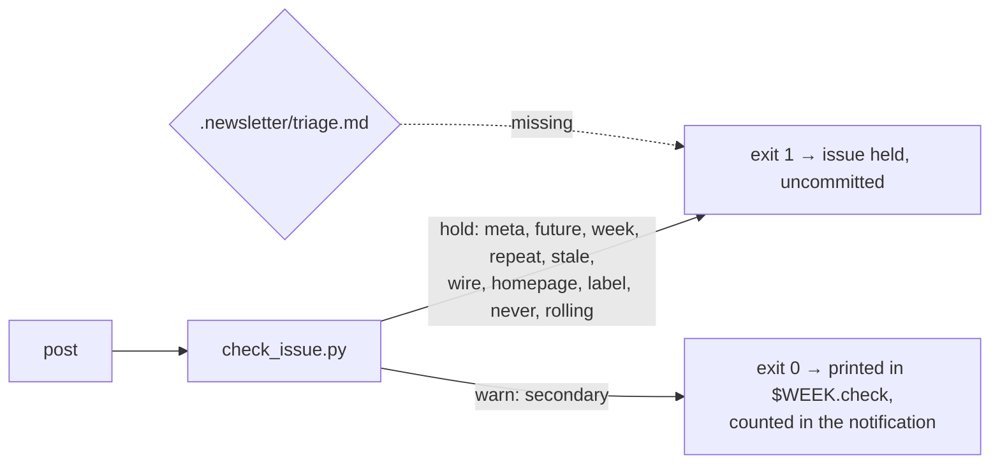

# Enforce the skill's own source rules, and stop the issue reading machine-made

## Goal

`/newsletter-ai` states rules it doesn't enforce, and the published issues break them. Two of the 25 items in `site/content/posts/2026-09-18.md` cite a rewrite of a primary the rewrite itself links to, which hard rule 7 forbids (`.claude/skills/newsletter-ai/SKILL.md:77`). Three citations across the two September issues point at rolling index pages, which hard rule 4 intends to exclude but does not name, so as written it permits them (`.claude/skills/newsletter-ai/SKILL.md:74`). Every issue reprints a fixed footer naming 15 source families, eight of which the 18 Sep issue never used. And the 18 Sep run published an issue but wrote no triage file, which the wrapper recorded as normal.

This spec moves the enforceable rules into `scripts/check_issue.py`, restructures `.claude/skills/newsletter-ai/SKILL.md` so the late rules are no longer the broken ones, and makes a skipped Step 5 hold the issue instead of passing unnoticed.

It's done when a checker run over `site/content/posts/2026-09-13.md` and `site/content/posts/2026-09-18.md` flags all three rolling-page citations and warns on both rule-7 breaches; when `make check` passes; and when a run whose model skips Step 5 leaves the issue uncommitted.

## Decision

This implements the [research note](~/notes/research/2026-09-18-newsletter-skill-critical-review.md)'s Recommendation, all four ranked items, which is its Options A and B — the note argues they fix disjoint defect sets, so both are in scope. The user settled four implementation choices on 2026-09-18:

- **Two severities, not one.** A `never` rule holds the issue for the outlets `.claude/skills/newsletter-ai/sources.md:11-13` ban outright. A `secondary` rule for habitual rewrite outlets prints a warning that does not hold. This departs from the note, whose ranked item 1 asks for "`secondary`, holding a tier-3 `[Source:]` host". The note's own Risks warn that false holds mute a gate, and `CLAUDE.md:22` forbids loosening a rule to get an issue out — so a taste judgement must not be able to block a push.
- **The footer loses its source list**, rather than being derived from the issue's own links each week. Nothing left to drift, and no new instruction for the model to get right.
- **The monoculture rules stay prose.** A per-publisher cap and a ban on reused pivot phrases go into `.claude/skills/newsletter-ai/SKILL.md`, and the checker learns nothing about sections. The note's Counter-evidence argues these faults are invisible to a regex gate *(unverified: a judgement drawn from two blog sources, not a row in the note's Verification table)*; teaching the checker sections is a Non-goal.
- **A missing triage file holds the issue.** Checked at Step 8, beside the checker, before the commit. A run that skipped one step may have skipped others.
- **The outlet lists live in code, not in `sources.md`.** This departs from the note, whose ranked item 1 asks for "a tiered outlet list to `sources.md` (primary / secondary / never) **and** two `check_issue.py` rules". One list in two places drifts; the repo already resolves this the other way for wires (Background, "Two precedents"). `sources.md` keeps the prose ban and points at the checker.

Rejected: holding on `secondary` hosts (a tier-2 outlet is often the only coverage); deriving the footer; a second `claude -p` call to retry Step 5 (another billed call and another failure mode).

## Background

Read at `c9ae1fd` on 2026-09-18. `c9ae1fd` landed mid-verification, adding 54 lines to `.claude/skills/newsletter-ai/sources.md` and changing 5; citations were re-read against it. "Don't cite" (`.claude/skills/newsletter-ai/sources.md:9-16`) and `docs/how-it-works.md` are untouched. "Search only" gained xAI News (`.claude/skills/newsletter-ai/sources.md:24`), and two catalogue entries changed in a way that matters to W2, recorded there. The research note was verified the same day, and every claim borrowed below is CONFIRMED in its Verification table, or corrected there and re-stated here, unless marked otherwise. Its Counter-evidence is the exception: those points were not checked as rows, so the two this spec leans on are marked *(unverified)* where they are used.

**The checker today.** `scripts/check_issue.py` is 297 lines, standard library only. `check()` returns a flat list of `(line, rule, message)` findings (`scripts/check_issue.py:181-275`); `main()` prints each as `path:line: rule: message` and returns 1 if there are any (`scripts/check_issue.py:291-293`). It has one severity: `scripts/weekly.sh:179-180` redirects its output to `$LOG/$WEEK.check` and holds the issue on any non-zero exit. Eight rules are implemented — `meta`, `future`, `week`, `repeat`, `stale`, `wire`, `homepage`, `label` — and nothing else.

`wire` matches a host-list constant (`scripts/check_issue.py:32-38`) against every link (`scripts/check_issue.py:257-259`), while `homepage` and `label` run only over `[Source: …]` links (`scripts/check_issue.py:261-273`). The 15 tests in `tests/test_check_issue.py` drive the checker through `subprocess` (`tests/test_check_issue.py:5`) against the two May issues in `tests/fixtures` and an inline clean post, so changing `check()`'s return shape breaks no existing test.

**Two precedents.** The banned-wire list lives in code, and the catalogue points at the checker rather than owning the list: `docs/sources.md:16` says wires are "already a hard rule, enforced by `scripts/check_issue.py`". The new host lists do the same. The five wire hosts are also spelled out in prose at `.claude/skills/newsletter-ai/SKILL.md:76`, so the pattern is a pointer plus a readable summary, not a single home. And `0a35445` added the `future` rule (`scripts/check_issue.py:210-217`) this same week, so a new rule here is a known-size change.

**What the gate can see.** `LABEL_DOMAINS` (`scripts/check_issue.py:40-49`) holds eight names, so the checker verified 6 of the 25 `[Source:]` labels in the latest issue. `DAY_IN_URL` (`scripts/check_issue.py:28`) matches `YYYY-MM-DD` as well as `YYYY/MM/DD` anywhere in a URL, so with `MONTH_IN_URL` and `ARXIV_ID` (`scripts/check_issue.py:29-30`) it could date 13 of that issue's 28 links. The rest of each issue is unchecked, which is why the stale-and-duplicate faults are gone and these four are not.

**The defects, with their evidence.** `site/content/posts/2026-09-18.md:131` cites [Techzine](https://www.techzine.eu/news/security/144330/major-flaw-in-ai-neoclouds-security-found-by-prospective-customer/), which credits and links Strix's own disclosure; `site/content/posts/2026-09-18.md:140` cites [The Register](https://www.theregister.com/ai-and-ml/2026/09/17/microsoft-ai-chief-warns-anthropic-not-to-put-ideas-in-claudes-head/5297149) summarising an essay it links at `mustafa-suleyman.ai/a-warning-about-model-welfare` ([research](~/notes/research/2026-09-18-newsletter-skill-critical-review.md) [7][8]).

The rolling pages are `site/content/posts/2026-09-13.md:89` (`code.claude.com/docs/en/changelog`), `site/content/posts/2026-09-13.md:257` (`epoch.ai/data/ai-data-centers`) and `site/content/posts/2026-09-18.md:281` ([`artificialanalysis.ai/changelog`](https://artificialanalysis.ai/changelog), where the cited v1.1 entry is fourth down although the permalink `/articles/artificial-analysis-capability-indices-v1-1` exists). All three sit inside `[Source: …]`, as does `site/content/posts/2026-05-14.md:107`, a fourth found while designing W2.

The footer at `.claude/skills/newsletter-ai/template.md:276` is reprinted at `site/content/posts/2026-09-18.md:303`, naming Reddit, Alignment Forum, OWASP, MITRE, NIST, CISA, IAPP and Ada Lovelace; none of that issue's 28 link hosts is any of them. The 13 Sep triage note's first item is a `fool.com` URL, the outlet `.claude/skills/newsletter-ai/sources.md:11` bans by name.

**Two corrections to the research.**

- The note's Recommendation says "Make `weekly.sh` hold a run with no `triage.md` rather than note it." It cannot hold there: `move_triage` runs at `scripts/weekly.sh:191`, after the commit and push at `scripts/weekly.sh:183-184`, so the issue is already live. W5 puts the check at Step 8 instead.
- The note's defect table says "Cloud Native is 2/2 `cncf.io/blog` in both issues, with a third CNCF blog link in Quick Links each week", corrected during its verification from "3/3". Either way the section is single-sourced both weeks; W4 addresses it as prose.

**One claim this spec does not rest on.** The note attributes the skipped Step 5 to its position after the "Output format" heading (`.claude/skills/newsletter-ai/SKILL.md:98` and `.claude/skills/newsletter-ai/SKILL.md:104`), reasoning from measured mid-context position effects *(unverified: the note's Counter-evidence, not a row in its Verification table)*. That the reorder will fix it is an *(assumption)*; spike question 1 probes the other candidate cause, and W5 makes the failure loud either way.

## Non-goals

- Teaching the checker about `##` sections, per-section publisher caps or repeated pivot phrases. The user chose prose for these; a follow-up spec can revisit it once W4's prose has had a few issues to work on.
- Any link-resolution or liveness rule. The note's Counter-evidence records six hosts in the latest issue that answer a `HEAD` request with 403 or 405 while serving normally *(unverified: recorded in the note's Counter-evidence, not checked as a Verification row)*, and `.claude/skills/newsletter-ai/sources.md:22-24` already lists 15 domains that block automated fetches (14 when the research note was written, before `c9ae1fd` added xAI News).
- Growth, reach, email and plugin packaging, as in `docs/specs/2026-09-13-weekly-local-publishing.md:90-99`.
- Changing what the model is allowed to do (`scripts/weekly.sh:159-163`). The note's "Leave alone" list keeps the tool posture as it is.
- Editing the four published posts. They are records; `site/content/posts/2026-09-18.md:303` keeps its footer.

## Design

Three new rules join the eight in `check()`, and the checker grows a second severity.

`check()` returns `(findings, warnings)`, both lists of `(line, rule, message)`. `main()` prints holds as it does today, then warnings as `path:line: warning: rule: message`, and returns 1 only if `findings` is non-empty. The severity comes first so that the `FINDING` regex at `tests/test_check_issue.py:14` captures `warning` as the rule: a warning can never be read as a hold.

Three new constants sit beside `WIRES` (`scripts/check_issue.py:32-38`):

- `NEVER`: `fool.com`, `seekingalpha.com`, `benzinga.com`, `investorplace.com`, `finance.yahoo.com`, `msn.com`, `sammyfans.com` — the outlets `.claude/skills/newsletter-ai/sources.md:11-13` bans unconditionally. Crypto outlets stay out of `NEVER`, because `.claude/skills/newsletter-ai/sources.md:14` bans them only for stories that aren't about crypto, and a host list can't tell.
- `SECONDARY`: `theregister.com`, `techzine.eu`, `techrepublic.com`, `techradar.com`, `venturebeat.com`, `dev.to`, `sherwood.news`, `forkast.news` — outlets that habitually rewrite. Warning only. The membership is a judgement *(assumption)*; the first three are the ones published issues have actually cited over a reachable primary.
- `ROLLING`: a path whose last segment is `changelog`, `trending`, `releases`, `blog` or `docs`, or whose first segment is `data`. This is narrower than the note's sketch, which had `/docs/**`: here `/docs/en/some-page` passes and only a bare `/docs` is held, because a docs page can carry a story while a docs root cannot.

`never` and `rolling` run over every link, as `wire` does, because the hard rules reach Quick Links: `.claude/skills/newsletter-ai/SKILL.md:72` says "each URL once, Quick Links included". `secondary` runs over `[Source: …]` links only, as `label` does, because the label is what claims the publisher.

The `data` pattern is the least principled of the six: it exists to catch `epoch.ai/data/ai-data-centers`, a live dataset page, and it is the one most likely to hold a good issue. W2's Done when pins its behaviour over the published posts, so loosening it later is a visible decision.

## Work items

### W1: The `never` rule

Hold an issue that links an outlet `sources.md` bans outright.

- `scripts/check_issue.py`: add a `NEVER` constant beside `WIRES` (`scripts/check_issue.py:32-38`) and a `never` rule beside `wire` (`scripts/check_issue.py:257-259`), over every link. `on_domain` (`scripts/check_issue.py:131-134`) already matches subdomains.
- `tests/test_check_issue.py`: a post linking `www.fool.com/investing/2026/09/09/…` fails with `never`; one linking `finance.yahoo.com` fails; a subdomain of a banned host fails, as `test_wire_subdomain` (`tests/test_check_issue.py:202`) already asserts for wires; the inline clean post (`tests/test_check_issue.py:16`) still passes.
- `.claude/skills/newsletter-ai/sources.md`: in "Don't cite" (`.claude/skills/newsletter-ai/sources.md:9-16`), say the checker enforces the investment, syndicated-finance and fan-site bullets, in the form `.claude/skills/newsletter-ai/sources.md:16` already uses for wires.
- `docs/sources.md`: the parallel catalogue carries its own "Don't cite" list (`docs/sources.md:7-16`) and `c9ae1fd` updates both in lockstep. Make the same edit there.
- `README.md`: `README.md:108` says two rules "rest on the skill alone, because the checker can't see them: no investment, fan or off-topic crypto sites, and at most four items per category". After W1 only the off-topic-crypto half and the item cap do; add the new rule to the enforced list at `README.md:101-106` and narrow `README.md:108`.
- `docs/how-it-works.md`: the hard-rule-to-checker-rule table at `docs/how-it-works.md:104-114` ends "| Primary or specialist outlets; nothing from the \"Don't cite\" list in `sources.md` | none: the model's rule |" (`docs/how-it-works.md:114`). Update that row for `never`; W2 and W3 update it again.

**Done when**: `python3 -m unittest discover tests` passes with the new tests; the checker over a post containing the 13 Sep triage note's `fool.com` URL prints a `never` line and exits 1; the four posts in `site/content/posts/` produce no `never` finding.

### W2: The `rolling` rule

Hold an issue that cites a living index instead of the page carrying the story.

- `scripts/check_issue.py`: add the `ROLLING` segment set and a `rolling` rule, over every link. Compare path segments after stripping a trailing slash, so `www.cncf.io/blog/2026/09/17/opentelemetry-…` and `cognition.com/blog/swe-2` pass while a bare `/blog` does not.
- `tests/test_check_issue.py`: the three real citations each fail with `rolling`; `www.cncf.io/blog/2026/09/16/…`, `vllm.ai/blog/2026-09-13-…`, `cognition.com/blog/swe-2` and `artificialanalysis.ai/articles/…` each pass; `epoch.ai/data/ai-data-centers` fails on the first-segment pattern.
- `.claude/skills/newsletter-ai/SKILL.md`: in hard rule 4 (`.claude/skills/newsletter-ai/SKILL.md:74`), name the forms the checker rejects, as rule 3 (`.claude/skills/newsletter-ai/SKILL.md:73`) already does for dates.
- `docs/how-it-works.md`: add `rolling` to the rule-4 row of the table at `docs/how-it-works.md:104-114`.
- `.claude/skills/newsletter-ai/sources.md` and `docs/sources.md`: four catalogue entries across the two parallel catalogues name a URL `rolling` would hold — the Claude Code changelog at `.claude/skills/newsletter-ai/sources.md:383` (which predates `c9ae1fd`) and `.claude/skills/newsletter-ai/sources.md:477` (which `c9ae1fd` added), and llama.cpp's releases page at `.claude/skills/newsletter-ai/sources.md:500`; `docs/sources.md:409`, `docs/sources.md:504` and `docs/sources.md:529` are the same entries in the other copy. `site/content/posts/2026-09-13.md:89` shows the changelog gets cited, not just searched. Mark each as a place to find a release, never to cite, and say what to cite instead.
- Other catalogue rows name an index URL too, such as `.claude/skills/newsletter-ai/sources.md:192` and `.claude/skills/newsletter-ai/sources.md:478`, and nothing in the table marks them as search-only *(assumption: the model reads a bare index URL as where to look, not as what to cite)*. Read the two new tables through once and mark any other row whose URL `rolling` would hold.

**Done when**: over `site/content/posts/2026-09-13.md` and `site/content/posts/2026-09-18.md` the checker reports exactly three `rolling` findings — at `site/content/posts/2026-09-13.md:89`, `site/content/posts/2026-09-13.md:257` and `site/content/posts/2026-09-18.md:281` — and no other rule new in W1 or W2 fires; W3 later adds three `secondary` warnings over the same post. Over `site/content/posts/2026-05-14.md` it also reports `site/content/posts/2026-05-14.md:107`, `github.com/vllm-project/vllm/releases`, a releases index and so a true positive; the commit message says so, since that post is a test fixture and future readers will meet it.

### W3: The warning channel and the `secondary` rule

Give the checker a severity that reports without holding, and use it for habitual rewrite outlets.

- `scripts/check_issue.py`: `check()` (`scripts/check_issue.py:181`) returns `(findings, warnings)`; `main()` (`scripts/check_issue.py:278-293`) prints warnings as `path:line: warning: rule: message` after the holds and returns 1 only on holds. Add the `SECONDARY` constant and a `secondary` rule over `[Source: …]` links, beside `label` (`scripts/check_issue.py:265-273`).
- `scripts/weekly.sh`: after Step 8's checker call (`scripts/weekly.sh:179-180`) succeeds, count the `: warning: ` lines in `$LOG/$WEEK.check` and carry the count into the Step 12 notification (`scripts/weekly.sh:194`) beside the cost, e.g. `Published 2026-W38 (~$7.63); 2 warnings; triage: 5 kept`. Say nothing when the count is zero.
- `tests/test_check_issue.py`: a post citing `theregister.com` inside `[Source: …]` exits 0 and prints one `warning: secondary:` line; the same URL outside a `[Source: …]` block produces nothing; a post with both a `never` link and a `secondary` link exits 1 and prints both, holds first.
- `tests/fake-claude.sh`: the fake post's source URL is hardcoded at `tests/fake-claude.sh:45`, so the offline test needs a mode that emits a `secondary` host.
- `tests/weekly_test.sh`: the offline run's notification carries the warning count when the fake post has a `secondary` citation.
- `docs/how-it-works.md`: add `secondary`, and the warn-versus-hold distinction, to the table at `docs/how-it-works.md:104-114`.
- `docs/customising.md`: `docs/customising.md:279` and `docs/customising.md:314` describe what `~/Library/Logs/newsletter/<week>.check` contains. Say that a passing run can now leave warning lines in it, and that the notification carries their count.

**Done when**: over `site/content/posts/2026-09-18.md` the checker prints exactly three `warning: secondary:` lines — at `site/content/posts/2026-09-18.md:131` (Techzine), `site/content/posts/2026-09-18.md:140` (The Register) and `site/content/posts/2026-09-18.md:173` (TechRepublic) — and no fourth. Its exit status there is 1, from W2's `rolling` hold at `site/content/posts/2026-09-18.md:281`, and removing that one link from a copy of the post drops it to 0 with the three warnings still printed: that pair of runs is what shows a warning doesn't hold. The first two warnings are the rule-7 breaches the research found; the third is the channel working on an outlet the research didn't examine, and is why `secondary` warns rather than holds. `make check` passes.

### W4: Restructure `SKILL.md` and add the monoculture rules

Stop the late rules being the broken ones, and write down what keeps two issues from reading the same.

- `.claude/skills/newsletter-ai/SKILL.md`: move the "Output format" section (`.claude/skills/newsletter-ai/SKILL.md:98-100`) to after Step 6c (`.claude/skills/newsletter-ai/SKILL.md:162-168`), so Steps 5 and 6 no longer sit behind a heading that reads like the end of the run. Promote hard rule 7 (`.claude/skills/newsletter-ai/SKILL.md:77`) to the top of the "Hard rules" list and renumber the rest; replace its "The checker doesn't enforce this rule" sentence with what the `secondary` warning does and does not do. Add to Step 2: at most one item per publisher per section, and no pivot phrase or case-study company reused from the previous issue. In Step 5, state that the hard rules apply to triage items as they do to issue items — `.claude/skills/newsletter-ai/SKILL.md:115` currently points at them only for the URL form.
- `docs/how-it-works.md`: the table at `docs/how-it-works.md:104-114` lists the hard rules in their current order, so W4's promotion and renumber changes it.
- Renumbering the rules changes the one reference that names a rule by number, `.claude/skills/newsletter-ai/SKILL.md:87` ("Step 2, rule 5"). Two more references need re-reading without being rule numbers: `.claude/skills/newsletter-ai/SKILL.md:115` ("Step 2's hard rules") and `.claude/skills/newsletter-ai/SKILL.md:69`, which describes what the checker can and can't see and will be wrong once `never` and `rolling` exist.

**Done when**: no numbered Step heading follows the "Output format" heading in `.claude/skills/newsletter-ai/SKILL.md`; rule 1 is the primary-or-specialist rule; `grep -n 'per publisher' .claude/skills/newsletter-ai/SKILL.md` hits in Step 2 and `grep -n 'hard rules' .claude/skills/newsletter-ai/SKILL.md` hits in Step 5; `grep -nE 'rule [0-9]' .claude/skills/newsletter-ai/SKILL.md` returns only `.claude/skills/newsletter-ai/SKILL.md:87`, carrying rule 5's new number; the description line (`.claude/skills/newsletter-ai/SKILL.md:3`) still says 14 categories; `make check` passes.

### W5: A missing triage file holds the issue

- `scripts/weekly.sh`: at Step 8, after the `git status` check (`scripts/weekly.sh:177-178`) and beside the checker call, require `$REPO/.newsletter/triage.md` to exist and `fail "held: no triage file; the model skipped Step 5"` if it doesn't. `.newsletter/` is in `.gitignore:1`, so the file's presence doesn't disturb `scripts/weekly.sh:177`'s expectation of exactly one untracked path. Leave `move_triage`'s own `no triage file` branch (`scripts/weekly.sh:71-74`) in place: it still covers the unpushed-issue path (`scripts/weekly.sh:135-139`), where the model didn't run at all.
- `tests/fake-claude.sh`: it always writes a triage file (`tests/fake-claude.sh:72-77`), so W5's case needs a mode that writes the post and skips it.
- `tests/weekly_test.sh`: that fake run leaves the tree dirty, exits non-zero, and notifies `held: no triage file`.
- `docs/customising.md`: "When an issue is held" (`docs/customising.md:277-288`) lists the recovery paths and has no entry for this hold. Add one: the post is deleted or kept by hand, as for a checker failure, and the notes feed is written off for that week.

**Done when**: `bash tests/weekly_test.sh` passes with the new case; a `PROBE` run is unaffected, since it exits at `scripts/weekly.sh:170-173` before Step 8.

### W6: Cut the footer's source list

- `.claude/skills/newsletter-ai/template.md`: replace the footer (`.claude/skills/newsletter-ai/template.md:276`) with `*Curated by Claude Code*`, dropping all 15 named source families, eight of which the latest issue doesn't use.

**Done when**: `grep -c 'OWASP\|MITRE\|Ada Lovelace' .claude/skills/newsletter-ai/template.md` returns 0; the next issue's last line is the new footer.

## Effort

Estimated by reading the code; the ordering matters more than the numbers.

| Item | Estimate | Why |
|---|---|---|
| W1 | 1 h | A constant, a rule modelled on `wire`, four tests, three prose edits |
| W2 | 1.25 h | Segment logic to test against the 115 published links; six tests |
| W3 | 2.5 h | `check()`'s shape, `main()`'s output, `scripts/weekly.sh`, two test files, two docs |
| W4 | 1.25 h | 168 lines to reorder without breaking rule-number references, plus the mirrored table |
| W5 | 1 h | Three lines, a fake-claude mode, an offline test case and a recovery entry |
| W6 | 10 min | One line |

About a day. W1–W3 are the note's highest-value change and land independently of W4–W6. Four items touch `docs/how-it-works.md:104-114`, so those edits want keeping small and in order rather than merged.

## Spike questions

1. **Is `Write` available to the model under the wrapper's allowlist?** `scripts/weekly.sh:161-162` enables `Write` in `--tools` but allowlists only `Edit(./site/content/posts/**)` and `Edit(./.newsletter/**)`, and `--permission-mode dontAsk` (`scripts/weekly.sh:160`) denies what isn't allowlisted. `.newsletter/triage.md` does not exist when the model starts, because `scripts/weekly.sh:147-148` clears the directory and copies in only `interests.txt`, so creating it needs whatever tool the harness uses for a new file. If that is denied, W4's reorder cannot fix Step 5 and W5 would hold every run. The run logs record no permission denials, which argues it is available, but that is inference *(assumption)*. Cheapest experiment: a headless `claude -p` in a scratch copy with the same `--tools`, `--allowedTools` and `--permission-mode` flags and a one-line prompt that must create a new file under `./.newsletter/`; then check whether the file exists and whether `permission_denials` is empty.
2. **Does moving "Output format" make the model write the triage file?** Only a real run answers it, and a real run costs about $7 (`~/Library/Logs/newsletter/2026-W38.json`, via the [research note](~/notes/research/2026-09-18-newsletter-skill-critical-review.md)) — beyond a spike box. Defer to the first scheduled run after W4 and W5 land; W5 makes a failure loud, so the answer arrives either way.

3. **Does `code.claude.com/docs/en/changelog` expose a per-version permalink or anchor?** W2 holds the bare changelog URL, and `.claude/skills/newsletter-ai/sources.md:477` lists it as the source for Claude Code releases, so the skill needs somewhere else to point. `artificialanalysis.ai` had a permalink for its cited entry; whether this one does is unknown *(assumption)*. Cheapest experiment: fetch the page and look for per-version `id` anchors or separate release URLs. Host: `code.claude.com`.

## Risks and rollback

- **`rolling`'s `data` pattern holds a good issue.** The likeliest false positive of the six patterns. Rollback is deleting one string from `ROLLING`; W2's Done when records what that changes. `CLAUDE.md:22` says fix the post, not the rule, so dropping it should be a commit of its own carrying the reasoning.
- **W5 turns a soft failure into a weekly hold.** If spike question 1 finds the write is denied, every run is held until the allowlist is fixed. Land W5 last, and run `launchctl kickstart` by hand once before trusting it.
- **`rolling` contradicts two entries in the catalogue it shares a repo with.** Until W2's `sources.md` edit lands, the skill is told to use the Claude Code changelog and llama.cpp releases pages while the checker holds any issue citing them. If spike question 3 finds the changelog has no per-version permalink, the honest resolutions are to cite the release it describes elsewhere or to drop `changelog` from `ROLLING` — not to keep both rules and let the issue be held.
- **W3 changes the checker's output contract.** Anything parsing `$WEEK.check` meets a new line shape. `grep -rn 'WEEK.check' scripts tests` finds the only code that reads it, `scripts/weekly.sh:179-180`; the human-facing description in `docs/customising.md:279` and `docs/customising.md:314` is outside that grep and is W3's job to update.
- **W4 edits the prompt that produces the issue.** A reorder can change the output in ways no test covers, so the first issue after it wants reading before it is trusted.

## Open questions

- Should `secondary` eventually hold, once a few issues show how often it fires? The count in the notification (W3) is the evidence that would settle it.
- Verifier round 2 ran on 2026-09-18, after verification, and returned `Plan holds: no` on W3's Done when for the second time: round 1 because the expected warning count was wrong, round 2 because the expected exit status was. Both are fixed above, and there is no round 3, so W3's Done when is the least-checked part of this spec and wants reading before it is worked to.
- `SECONDARY`'s membership is a taste list. `dev.to` and `sherwood.news` are on it because past issues cited them for stories they had rewritten; `theregister.com` is on it although it also breaks its own stories.
